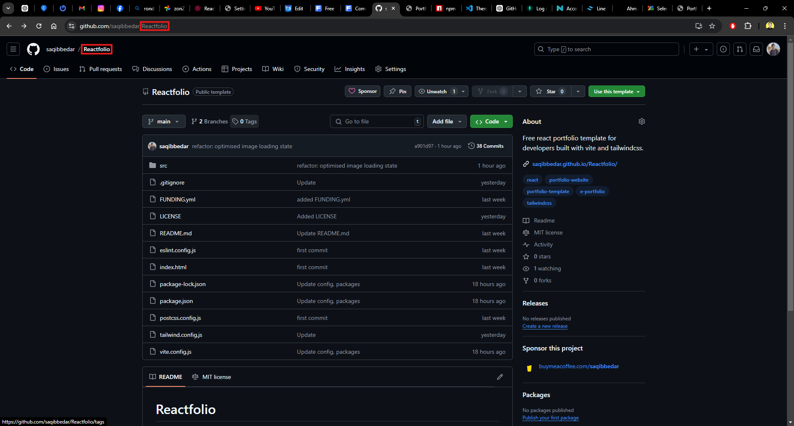
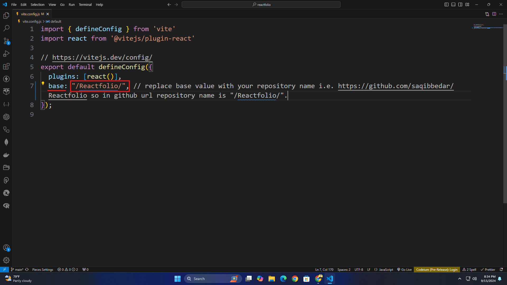

# Reactfolio

Welcome to **Reactfolio**, a customizable portfolio template built with React, Vite and TailwindCSS. This template allows you to easily create your own developer portfolio for free. It is designed to be flexible and easy to modify, with all the data stored in a single [`assets.js`](https://github.com/saqibbedar/Reactfolio/blob/main/src/assets/assets.js) file.


# Demo

Check out the live demo of the portfolio [here](https://saqibbedar.github.io/Reactfolio/).


# Prerequisite

Before starting, ensure you have the following installed on your machine:

1. **NodeJS:** You can download and install it from [here](https://nodejs.org/en/download/prebuilt-installer).

2. **Git:** Download and install Git from [here](https://git-scm.com/downloads).


# Getting started

Follow these steps to create and deploy your portfolio:

### Step 1: Fork and Clone the Repository

To begin, you should fork the repository so you have your own copy of the project.

1. Click the Fork button at the top-right corner of this page to create a copy of the repository in your GitHub account.
2. Once the repository is forked, clone it to your local machine by running the following command in your terminal:

```bash
git clone https://github.com/your-username/Reactfolio
```

Replace `your-username` with your actual GitHub username.

### Step 2: Install Dependencies

Navigate to the project folder and install the required dependencies:

```bash
cd reactfolio
npm install
```

### Step 3: Start deployment server

Start your development server with the following command to preview your portfolio:

```bash
npm run dev
```

You can view your website locally on [`http://localhost:5173/Reactfolio/`](http://localhost:5173/Reactfolio/)

### Step 4: Update [`assets.js`](https://github.com/saqibbedar/Reactfolio/blob/main/src/assets/assets.js) file Data

The main data for the portfolio is located in the [`assets.js`](https://github.com/saqibbedar/Reactfolio/blob/main/src/assets/assets.js) file. Open it and replace the dummy data with your actual information:

<details>
<summary>Here is a basic structure of what you need to update in <code>assets.js</code>:</summary>

```js
// Replace dummy values with your actual information.
const AboutPage = {
  authorProfile: "Your Profile Image URL",
  authorDescription: "A short bio about yourself",
  getInTouchUrl: "Your Contact Page URL",
  authorName: "Your Name",
  profileImgTagLine: "Your Job Title or Tagline",
  authorContactMail: "Your Email Address",
  authorContactNumber: "Your Phone Number",
};

// Similarly, update other values as needed...
```

</details>

### Step 5: Update [`vite.config.js`](https://github.com/saqibbedar/Reactfolio/blob/main/vite.config.js) File

After updating your data in `assets.js`, you’ll need to modify the `base` value in the `vite.config.js` file with your repository name for proper deployment:

<details>
  <summary><b>Get Your Repository Name</b></summary>

  * **Repository name:** This image shows where to find your repository name in GitHub.

  

</details>

<details>
  <summary><b>Change <code>base</code> Value in <code>vite.config.js</code></b></summary>

  * **Update base value:** Replace the `base` value with your GitHub repository name.

  

</details>
 

### Step 6: Update Git Repository

Before deploying, push your changes to your GitHub repository:

```bash
git add .
git commit -m "Customize portfolio"
git push origin main
```

### Step 7: Deploy your portfolio

Once everything is set up, you can deploy your portfolio to GitHub Pages by running the following command:

```
npm run deploy
```

Your portfolio will be live at [`https://your-username.github.io/your-repo-name/`](https://your-username.github.io/your-repo-name/). Replace `your-username` and `your-repo-name` with your actual GitHub username and repository name.

# Support Me ❤️

This project is completely free under the [`MIT LICENSE`](https://github.com/saqibbedar/Reactfolio?tab=MIT-1-ov-file). If you’ve found this project helpful and would like to support its development, you can consider buying me a coffee. Your support is greatly appreciated!

<div align="center">
<a href="https://www.buymeacoffee.com/saqibbedar"></a></div>