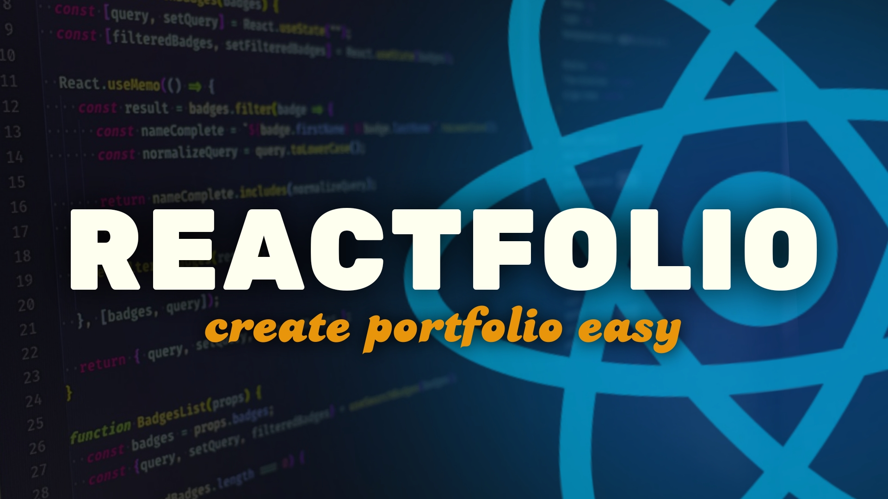

<div align="center">
<span><h1><a href="https://saqibbedar.github.io/Reactfolio/" target="_blank">Reactfolio.</a> v1.7.0</h1></span>

<span>Designed for developers looking to showcase their work with style and simplicity.</span>

<div align="center">
    
    
  
   
  
</div>

</div>

</br>



# Welcome Docker Users! 🚀

**Reactfolio** now supports Docker from version 1.4.0! If you're interested in containerizing your portfolio and deploying it with ease, you're in the right place. We've created a new `docker-deploy` branch specifically for users who want to build and deploy their projects using Docker. This branch includes automated deployment via GitHub Actions, making it simpler than ever to showcase your work.

# Installation & Setup 🛠️

Follow these steps to create and deploy your portfolio:

## Step 1: Fork and Clone the Repository 📂

To begin, you should fork this repository so you have your own copy of the project.

1. Click the **Fork** button at the top-right corner of this page to create a copy of the repository in your GitHub account.
2. Once the repository is forked, clone it to your local machine by running the following command in your terminal:

```bash
git clone https://github.com/saqibbedar/Reactfolio.git
```

## Step 2: Update [`assets.js`](https://github.com/saqibbedar/Reactfolio/blob/main/src/assets/assets.js) file Data 📝

The main data for the portfolio is located in the `assets.js` file. Open it and replace the dummy data with your actual information:

Here is a basic structure of what you need to update in assets.js`

```js
// Replace dummy values with your actual information.
const AboutPage = {
  authorProfile: "Your Profile Image URL",
  authorDescription: "A short bio about yourself",
  getInTouchUrl: "Your Contact Page URL",
  authorName: "Your Name",
  profileImgTagLine: "Your Job Title or Tagline",
  authorContactMail: "Your Email Address",
  authorContactNumber: "Your Phone Number",
};

// Similarly, update other values as needed...
```

## Step 3: Docker Setup 🐳

If you prefer Docker for serving your portfolio, follow these steps:

- **Build Docker Image**

  1. Build the Docker image by navigating to your project directory and running:

      ```bash
      docker build -t reactfolio .
      ```
  2. Once the image is built, you can run it with:
      ```bash
      docker run -d -p 5000:5000 reactfolio
      ```
      The portfolio will be served locally at http://localhost:5000.

## Step 4: Switch to `docker-deploy` Branch

Before making any changes, ensure you are on the `docker-deploy` branch. You can switch to this branch using the following command:

```bash
git checkout docker-deploy
```

## Step 5: Push Changes to GitHub

Once you’ve updated the `assets.js` file, you can push your changes to your GitHub repository on the `docker-deploy` branch.

```bash
git add .
git commit -m "Customize portfolio"
git push origin docker-deploy
```
# Community & Feedback 💬

We'd love to hear from you! Whether you have questions, ideas, or feedback, you can engage with the Reactfolio community in our GitHub Discussions. Share your experience, ask questions, or suggest features.

[Join the discussion](https://github.com/saqibbedar/Reactfolio/discussions)

By participating in the discussions, you’ll help shape the future of Reactfolio. Feel free to start a new conversation or respond to existing ones!
# Contributing 🤝

We welcome contributions from everyone! By contributing to this project, you not only help improve it but also get your contributions recognized on the ORCID platform. I have contributed to this project on [ORCID](https://orcid.org/0009-0006-2554-8074), where it is properly described and cited under software.

Feel free to open issues or submit pull requests. Your contributions will be acknowledged, and you can add them to your ORCID profile to showcase your work and gain recognition in the academic and professional community.

For more details read [Contribution guidelines](./CONTRIBUTING.md) in detail.

Join us in making this project better and get your contributions recognized!

# Support Project ❤️

This project is completely free under the [`MIT LICENSE`](https://github.com/saqibbedar/Reactfolio?tab=MIT-1-ov-file). If you’ve found this project helpful and would like to support its development, you can consider buying me a coffee. Your support is greatly appreciated!

<div align="center">
<a href="https://www.buymeacoffee.com/saqibbedar"></a></div>